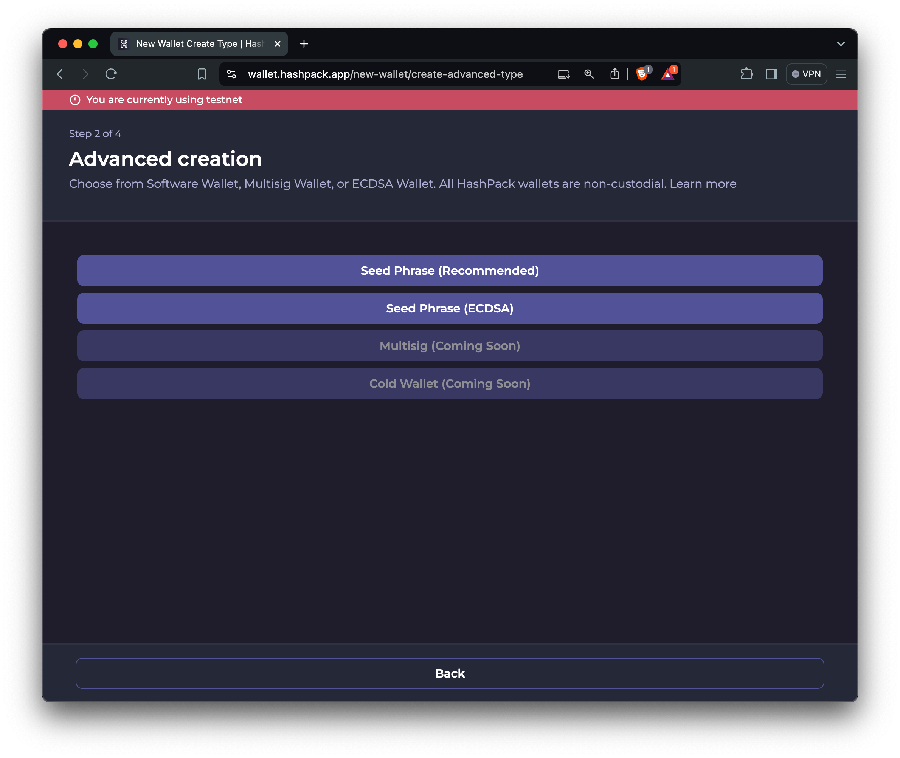

# Get Your Testnet Account

.This guide outlines two methods for creating a Hedera Testnet account: the Developer Portal and the anonymous Faucet. The Developer Portal requires a sign-up but provides an initial HBAR balance, while the Faucet allows for anonymous account creation and HBAR dispensing with minimal hassle.

**➡** [**Hedera Faucet**](introduction.md#hedera-faucet)&#x20;

**➡** [**Hedera Developer Portal**](introduction.md#hedera-developer-portal)

**➡** [**ECDSA Account via HashPack**](introduction.md#testnet-ecdsa-account-via-hashpack)

## Comparison Table: Hedera Developer Portal vs. Hedera Faucet

This comparison table highlights the differences between using the Hedera Developer Portal and the Hedera Faucet to create testnet accounts and receive HBAR. It helps you decide which path is best for you. The faucet is recommended for EVM developers as it is a familiar tool and only requires a wallet address to auto-create an account.

<table><thead><tr><th width="213">Feature</th><th>Developer Portal</th><th>Hedera Faucet</th></tr></thead><tbody><tr><td><strong>Account Creation</strong></td><td>Sign up/login required, Automatically receive 1000 HBAR upon account creation</td><td>No sign-up; anonymous, Receive 100 HBAR </td></tr><tr><td><strong>Dispense Limit</strong></td><td>Up to 1000 HBAR per day</td><td>Up to 100 HBAR per day</td></tr><tr><td><strong>Ease of Use</strong></td><td>Centralized dashboard for management</td><td>Simple, quick access from link</td></tr><tr><td><strong>Access to Faucet</strong></td><td>Available from the portal dashboard</td><td>Direct access from the faucet URL</td></tr><tr><td><strong>Additional Features</strong></td><td>Personal access tokens (API keys), manage accounts, store private keys</td><td>N/A</td></tr></tbody></table>

***

## Hedera Developer Portal

The Hedera developer portal allows you to create a testnet account to receive testnet HBAR. Go to [Hedera Developer Portal](https://portal.hedera.com/) and follow the instructions to create a testnet account.&#x20;

<figure><figcaption></figcaption></figure>

After account creation, your new testnet account will automatically receive **1000 HBAR,** and you'll see your account ID and key pair from the portal dashboard (see image below). Copy your _account ID_ and _DER-encoded private key_ for the coding environment setup step.&#x20;

<figure><figcaption></figcaption></figure>

The portal dashboard also serves as a central location where you can manage your account IDs and private keys, easily access the testnet HBAR, and unlock features like a personal access token (API key).

<figure><figcaption></figcaption></figure>

***

## Hedera Faucet 

The Hedera Faucet gives free testnet HBAR anonymously, and you won't need to sign up for an account on the Developer Portal.  To use the anonymous faucet, visit the [faucet](https://portal.hedera.com/faucet) page and enter your EVM wallet address where it says "Enter Wallet Address."&#x20;

#### EVM wallet address  ➡  Hedera account ID&#x20;

Entering an EVM address initiates an auto account creation flow, creating a new testnet account. Once the testnet account is created successfully, your new account ID will return in the same pop-up window where you requested to receive HBAR. Copy and save your new account ID (see the image below). You will need the account ID AND private key, which will be used later to configure your environment variables.&#x20;

<figure><figcaption></figcaption></figure>

 

<figure><figcaption></figcaption></figure>

_**📣 Please note**: This faucet can dispense a maximum of 100 HBAR every 24 hours. If you try to use the faucet before the timer runs out, you'll get the above error message._&#x20;

<figure><figcaption></figcaption></figure>

 

<figure><figcaption></figcaption></figure>


**Note**: Testnet accounts on the developer portal are subject to a daily top-up limit of 1000 HBAR. Accounts _**do not**_ automatically get topped up. To top up your balance, you must manually request a refill through the portal dashboard every 24 hours.

For clarity, topping up does not add an additional 1000 HBAR to your account balance. Instead, if your account balance falls below this threshold, up to 1000 HBAR is replenished. For example, if your account balance is 500 HBAR, refilling will only add enough HBAR to bring your balance to 1000 HBAR.


***

## **Testnet ECDSA Account via HashPack**

HashPack wallet allows you to create an ECDSA account. Follow the steps below to create an ECDSA testnet account.

1. [Download](https://www.hashpack.app/download) the HashPack wallet extension or mobile app.
2. Open HashPack and follow the prompts to create a new ECDSA account. Select **Testnet account** and **Create a new wallet**.
3. Choose the **Advanced Creation** option and the **Seed Phrase (ECDSA)** option. Save your seed phrase, private key, and new Hedera account ID in a safe location.
4. Fund your new testnet account by visiting the faucet and following the previous ["Hedera Faucet" step](introduction.md#hedera-faucet).

<figure><figcaption></figcaption></figure>

 

<figure><figcaption></figcaption></figure>

***

## Next Steps

Now that you have a funded Hedera Testnet account and some HBAR, you can start building on Heder. First, set up your environment on the following page!
